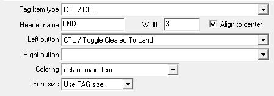
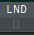
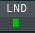
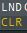

# CTL
"Cleared To Land" Helper for Euroscope

## Installation

- Load the CTL.dll into Euroscope via `other SET  -> Plug-ins ...`
- Add a new Column in the prefered List like:

- Installation complete.

## Usage

Just click the button and you can toggle the landing clearance state

(default state) means ACFT is _not_ cleared to land

(manual input) means ACFT is cleared to land

(automatic action) means ACFT is in short final and should be cleared asap

(Distance to Airport < 6nm & 
lower than 1500ft &
ACFT is tracked by you)

